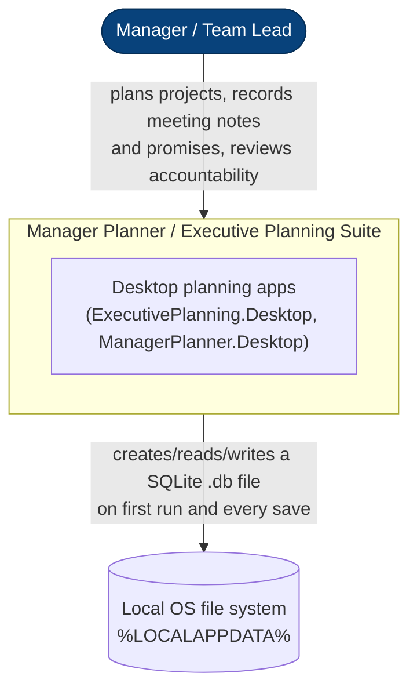
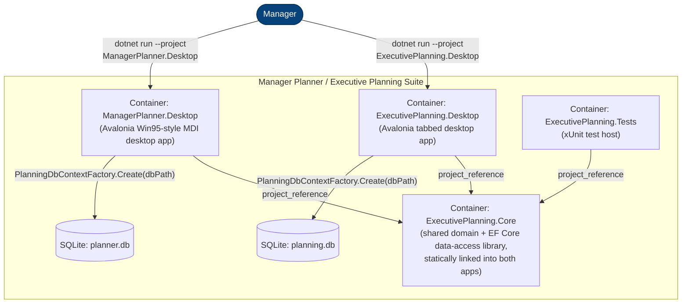
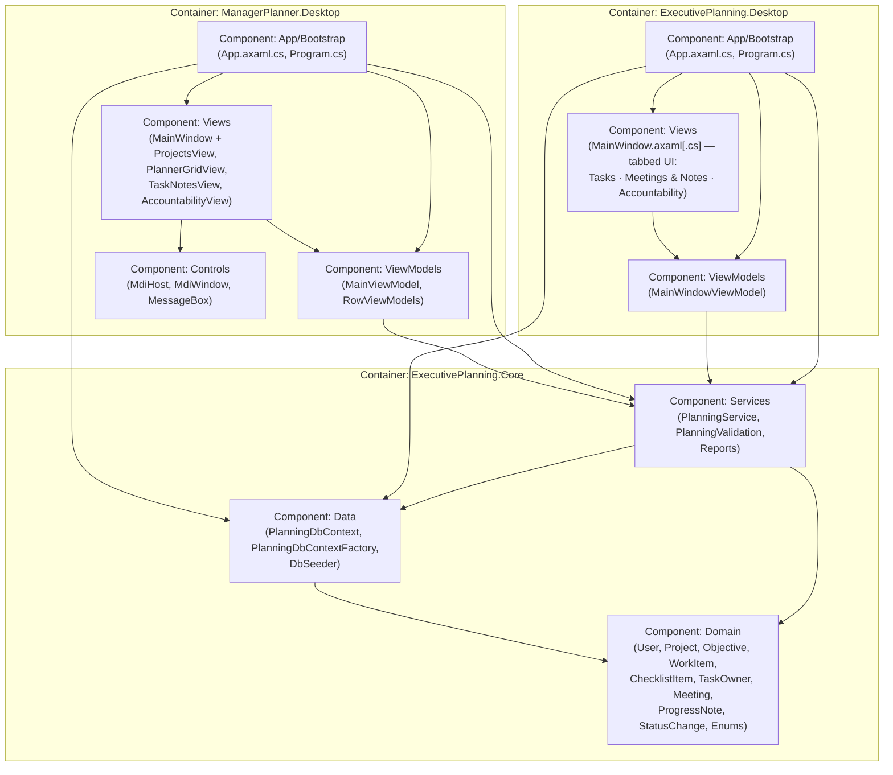
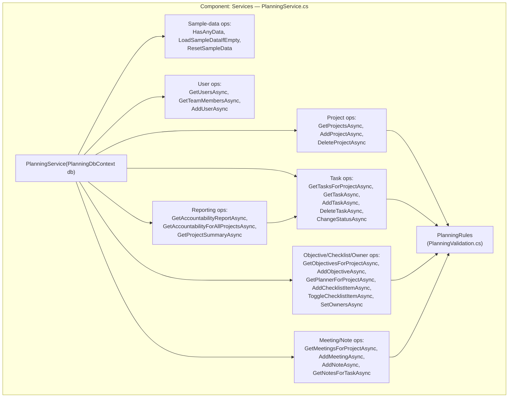
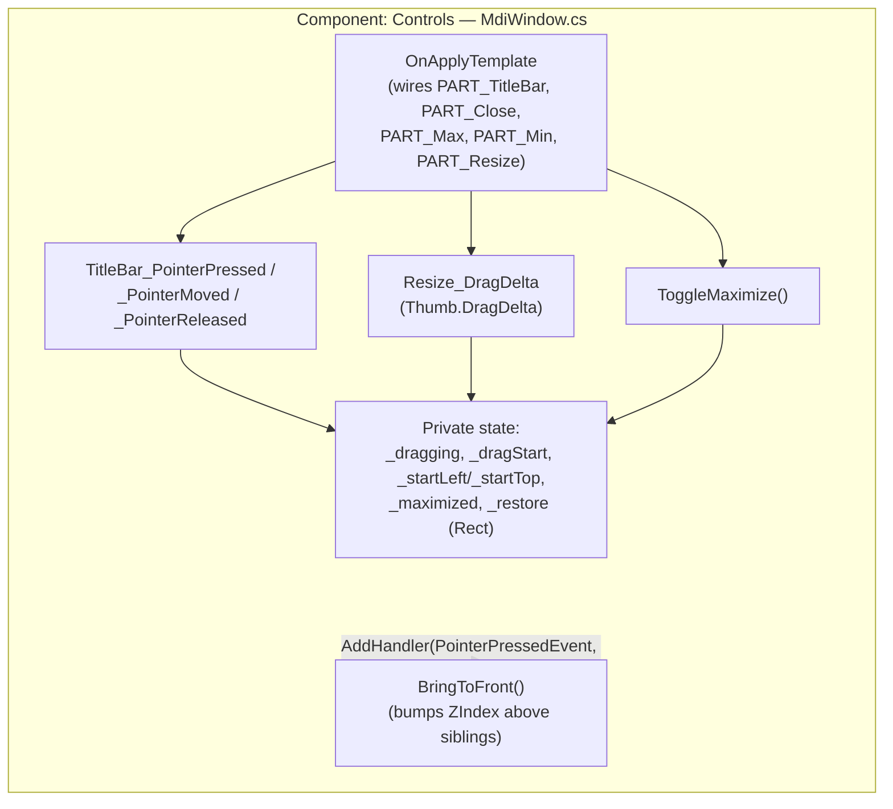

# Architecture Analysis — Manager Planner / Executive Planning

**Path analyzed:** `.` (repository root)
**Date analyzed:** 2026-07-27

> Note: no `templates/architecture.md` scaffold was found in the installed specclaw plugin
> (`chan4lk/specclaw` 0.4.2 — its `templates/` directory has no `architecture.md`). This report
> follows the L1→L4 C4 rubric structure directly; no placeholder tokens were available to fill in.

This repo (`ExecutivePlanning.sln`) is a single system with two independent Avalonia desktop
front ends — `ExecutivePlanning.Desktop` and `ManagerPlanner.Desktop` — sharing one
`ExecutivePlanning.Core` library. Both front ends, `ExecutivePlanning.Core.csproj`,
`ManagerPlanner.Desktop.csproj`, and `tests/ExecutivePlanning.Tests.csproj` all reference
`ExecutivePlanning.Core.csproj` (`dependency_graph`, `kind: project_reference`) — confirmed by
reading both apps' `App.axaml.cs` and both `.csproj` files.

---

## L1 — System Context

### Diagram

### Findings

- **Primary actor: the Manager.** README.md states the app is "for a manager to plan and hold
  their team accountable. The manager creates projects, breaks them into tasks assigned to team
  members with deadlines, records what each member *says* during video/physical/phone meetings,
  ... and cross-checks what was promised versus what was delivered." Team members themselves are
  data subjects recorded by the Manager (`Domain/User.cs`'s `UserRole.TeamMember`), not direct
  users of the software — there is no multi-user login, network API, or remote collaboration
  surface in any manifest or opened file.
- **No external network systems or third-party APIs.** No manifest in `manifests` declares an
  HTTP client/server package (no ASP.NET Core, no HttpClient-based integration package), and
  neither `App.axaml.cs` opens a socket or calls out to a remote service — the only external
  dependency across both desktop apps' `.csproj` files is the Avalonia UI stack plus
  `CommunityToolkit.Mvvm`, and Core's only package is `Microsoft.EntityFrameworkCore.Sqlite`.
- **The one true external system is the local OS file system**, specifically
  `%LOCALAPPDATA%` — confirmed directly in `PlanningDbContextFactory.DefaultDatabasePath()`
  (`Environment.GetFolderPath(Environment.SpecialFolder.LocalApplicationData)` → `.../ExecutivePlanning/planning.db`)
  and in `ManagerPlanner.Desktop/App.axaml.cs` (`.../ManagerPlanner/planner.db`). The system reads
  and writes a persistent SQLite file there on every launch and every save; README.md confirms
  the same paths for both Windows and macOS.

---

## L2 — Containers

### Diagram

### Findings

- **Two independently runnable Avalonia GUI containers**, each with its own `Program.cs`
  (`[STAThread] Main → BuildAvaloniaApp().StartWithClassicDesktopLifetime(args)`) and `App.axaml.cs`
  composition root — `src/ExecutivePlanning.Desktop` and `src/ManagerPlanner.Desktop`. Both are
  confirmed distinct deployables: `publish/publish-windows.ps1` and `publish/publish-mac.sh`
  (per `top_level_dirs`) target `ManagerPlanner.Desktop` for self-contained single-file publish,
  while README.md's build instructions run `ExecutivePlanning.Desktop` via `dotnet run`.
- **One shared library container, `ExecutivePlanning.Core`.** It is not separately deployable
  (no `Program.cs`, no `OutputType` for an executable) but is a structurally distinct container:
  it owns the EF Core `DbContext`, the domain entities, and the only significant business-logic
  facade (`PlanningService`), and both GUI containers link it in via
  `<ProjectReference Include="..\ExecutivePlanning.Core\ExecutivePlanning.Core.csproj" />`
  (`dependency_graph`, `kind: project_reference`, confirmed in both `.csproj` files).
- **Two separate SQLite database files by explicit design**, not one shared store. Read directly
  in `ManagerPlanner.Desktop/App.axaml.cs`: *"v2 has extra tables (Objectives, ChecklistItems,
  TaskOwners), so it uses its own database file — EnsureCreated does not migrate the v1 file in
  place."* `ExecutivePlanning.Desktop/App.axaml.cs` calls
  `PlanningDbContextFactory.DefaultDatabasePath()` → `%LOCALAPPDATA%\ExecutivePlanning\planning.db`,
  while `ManagerPlanner.Desktop/App.axaml.cs` builds its own path →
  `%LOCALAPPDATA%\ManagerPlanner\planner.db`. Both call the same
  `PlanningDbContextFactory.Create(dbPath)` (`Data/PlanningDbContextFactory.cs`, which only calls
  `ctx.Database.EnsureCreated()` — no EF Core migrations exist anywhere in the repo).
- **A test container, `tests/ExecutivePlanning.Tests`**, exercises `ExecutivePlanning.Core` only
  — its sole `ProjectReference` (per `dependency_graph` and its `.csproj`) is to
  `ExecutivePlanning.Core.csproj`. `TestDb.cs` builds a real in-memory SQLite connection
  (`"DataSource=:memory:"`) rather than faking the database, and `PlanningServiceTests.cs` is the
  only substantive test file — `UnitTest1.cs` is a template placeholder. Neither GUI container has
  any test coverage.

---

## L3 — Components

### Diagram

### Findings

**`ExecutivePlanning.Core`:**

- **Domain** (`Domain/*.cs`) — plain entity classes with no logic beyond a couple of
  documentation-only comments (e.g. `ProgressNote.cs`'s note that it is "the heart of the
  accountability feature"). Confirmed by reading `Enums.cs` (`ProjectStatus`, `WorkItemStatus`,
  `MeetingType`, `UserRole`) directly.
- **Data** (`Data/PlanningDbContext.cs`, `PlanningDbContextFactory.cs`, `DbSeeder.cs`) —
  `PlanningDbContext.OnModelCreating` (read in full, 195 lines) declares every relationship and
  delete rule (e.g. `Project→WorkItem` cascade, `User→Project` restrict, `WorkItem→Assignee`
  set-null). `PlanningDbContextFactory.Create` wraps `UseSqlite(...)` +
  `ctx.Database.EnsureCreated()`. `DbSeeder.Seed`/`SeedIfEmpty`/`ResetToSampleData` directly
  construct `Domain` entities (`new User { ... }`, `new Project { ... }`) — grounding the
  **Data → Domain** edge.
- **Services** (`Services/PlanningService.cs`, `PlanningValidation.cs`, `Reports.cs`) —
  `PlanningService`'s constructor `public PlanningService(PlanningDbContext db) => _db = db;`
  grounds the **Services → Data** edge; nearly every method (`AddProjectAsync`, `AddTaskAsync`,
  `AddNoteAsync`, etc.) instantiates a `Domain` entity directly, grounding **Services → Domain**.
  `PlanningRules` (in `PlanningValidation.cs`) is a static validator class called from
  `PlanningService` (e.g. `PlanningRules.ValidateProjectName(name)`), and `Reports.cs` defines the
  `AccountabilityRow`/`ProjectSummary` DTOs returned by `PlanningService.GetAccountabilityReportAsync`
  and `GetProjectSummaryAsync`.

**`ExecutivePlanning.Desktop`:**

- **App/Bootstrap** (`App.axaml.cs`, `Program.cs`) — the composition root. Read directly:
  `OnFrameworkInitializationCompleted` calls `PlanningDbContextFactory.DefaultDatabasePath()`,
  `PlanningDbContextFactory.Create(dbPath)`, `DbSeeder.SeedIfEmpty(db)` (grounding
  **App/Bootstrap → Core/Data**), then `new PlanningService(db)` (grounding
  **App/Bootstrap → Core/Services**), then `new MainWindowViewModel(service, dbPath)` and
  `new MainWindow { DataContext = vm }` (grounding **App/Bootstrap → ViewModels** and
  **App/Bootstrap → Views**). There is no DI container anywhere — every dependency is `new`'d up
  by hand in this one method.
- **ViewModels** (`MainWindowViewModel.cs`, 218 lines, read in full) — every command
  (`AddProjectAsync`, `AddTaskAsync`, `AddMeetingAsync`, `AddNoteAsync`, `SetStatusAsync`,
  `RefreshAsync`) calls `_service.*` directly (e.g. `await _service.AddTaskAsync(...)`),
  grounding **ViewModels → Core/Services**. No repository/abstraction layer sits between the VM
  and the Core service.
- **Views** (`Views/MainWindow.axaml` + `.axaml.cs`) — `MainWindow.axaml` declares
  `x:DataType="vm:MainWindowViewModel"` and binds directly to VM members
  (`ItemsSource="{Binding Projects}"`, `SelectedItem="{Binding SelectedProject}"`,
  `Command="{Binding RefreshCommand}"`), grounding **Views → ViewModels**. `MainWindow.axaml.cs`
  itself is a trivial 11-line partial class with only `InitializeComponent()` — all wiring lives
  in the App/Bootstrap component and in XAML bindings.

**`ManagerPlanner.Desktop`:**

- **App/Bootstrap** (`App.axaml.cs`, `Program.cs`) — structurally identical composition-root
  pattern to `ExecutivePlanning.Desktop`'s, confirmed by direct comparison of both `App.axaml.cs`
  files: same `PlanningDbContextFactory.Create` → `DbSeeder.SeedIfEmpty` → `new PlanningService`
  → `new MainViewModel(service, dbPath)` → `new MainWindow { DataContext = vm }` sequence, but
  with its own `%LOCALAPPDATA%\ManagerPlanner\planner.db` path built inline rather than via
  `PlanningDbContextFactory.DefaultDatabasePath()`.
- **ViewModels** (`MainViewModel.cs`, 289 lines; `RowViewModels.cs`) — every command
  (`AddNote`, `MarkDone`, `AddObjective`, `AddProject`, `DeleteProject`, `DeleteTask`, `Refresh`,
  `LoadSampleData`, `ResetSampleData`) calls `_service.*` directly (e.g.
  `await _service.AddObjectiveAsync(SelectedProject.Id, NewObjectiveTitle)`), grounding
  **ViewModels → Core/Services**. `RowViewModels.cs`'s `TaskRowVm` also walks nested
  `ChecklistItem` trees client-side (`BuildTree`/`byParent` lookup) to render the checklist
  hierarchy the grid displays.
- **Views** (`Views/MainWindow.axaml[.cs]`, `ProjectsView`, `PlannerGridView`, `TaskNotesView`,
  `AccountabilityView`) — `MainWindow.axaml.cs`'s `OnOpened` handler directly constructs
  `new MdiWindow { Header = "Projects", Content = new ProjectsView() }` (and three more) and calls
  `Host.AddWindow(...)`, `Host.Cascade()`, `Host.Tile()`, `Host.Restore(...)` on the `Host`
  (`<controls:MdiHost x:Name="Host" .../>`, confirmed in `MainWindow.axaml`), grounding
  **Views → Controls**. The same handler also wires `vm.MessageRequested += async msg => await
  MessageBox.Show(this, "Manager Planner", msg);` and `vm.ConfirmAsync = msg =>
  MessageBox.Confirm(this, "Manager Planner", msg);` — a second, separate **Views → Controls**
  edge (dialogs) plus a **Views → ViewModels** edge (subscribing to VM events,
  `x:DataType="vm:MainViewModel"` bindings in `MainWindow.axaml`).
- **Controls** (`MdiHost.cs`, `MdiWindow.cs`, `MessageBox.cs`, styled by `Themes/Win95.axaml`) —
  hand-rolled MDI chrome and modal dialogs rather than Avalonia's built-in `Window`/dialog
  primitives. `MdiHost` (a `Canvas` subclass) implements `AddWindow`/`Cascade`/`Tile`/`Restore`;
  `MdiWindow` (a `HeaderedContentControl` subclass) implements its own drag/resize/maximize state
  machine (see L4 below); `MessageBox` builds ad-hoc `Window` dialogs styled with `#c0c0c0`
  grey background and a `"Tahoma, 'MS Sans Serif', ..."` font stack.

---

## L4 — Code

Per the L4 Judgment Rule, two components warrant a Code-level diagram; all others do not.

### `ExecutivePlanning.Core` / Services — `PlanningService` (god-object facade)

**Why it qualifies:** it is a suspected god-object (bullet 2) and the component the existing
codebase report itself identifies as the first place to point an onboarding effort (bullet 3) —
confirmed by reading `Services/PlanningService.cs` in full (367 lines): a single class holding
one `PlanningDbContext` field and funneling every feature area (sample-data lifecycle, Users,
Projects, Tasks, Objectives, Checklist items, Owners, Meetings & Notes, and Reporting) through
one flat set of public methods, called directly by both Desktop apps' ViewModels with no
interface or repository seam in between.

Grounded entirely in the full read of `PlanningService.cs`: e.g.
`AddProjectAsync` calls `PlanningRules.ValidateProjectName(name)` before constructing the
entity; `AddNoteAsync` calls `PlanningRules.ValidateNoteText(text)` and
`PlanningRules.ValidateNoteDate(effectiveDate)`; `GetAccountabilityReportAsync` (lines 269-330)
queries `_db.WorkItems` directly and derives `PromiseKept`/`PromiseBroken`/`IsOverdue` per row —
it is Reporting, not Tasks, that owns this derivation, though it reads the same `WorkItem`/`Notes`
shape the Task ops expose.

### `ManagerPlanner.Desktop` / Controls — `MdiWindow` (bespoke drag/resize/maximize state machine)

**Why it qualifies:** its internal structure is non-obvious from its name/location alone (bullet
1) — "a titled, draggable, resizable frame" sounds like a thin wrapper, but it hand-rolls a full
pointer-event state machine rather than using any Avalonia window primitive, confirmed by reading
`MdiWindow.cs` in full (127 lines).

Grounded in the opened file: `TitleBar_PointerPressed` captures `_dragStart`/`_startLeft`/
`_startTop` and calls `e.Pointer.Capture(_titleBar)`; `TitleBar_PointerMoved` computes the new
position from `_dragStart` and writes `Canvas.SetLeft`/`SetTop`; `ToggleMaximize` stashes the
pre-maximize bounds in `_restore` (a `Rect`) and restores from it on toggle-back; none of this
state is exercised by any test (`tests/ExecutivePlanning.Tests` only references
`ExecutivePlanning.Core.csproj`, confirmed via `dependency_graph`).

### All other components

- `ExecutivePlanning.Core` / **Domain** — L4 not warranted for this component.
- `ExecutivePlanning.Core` / **Data** — L4 not warranted for this component.
- `ExecutivePlanning.Desktop` / **App/Bootstrap** — L4 not warranted for this component.
- `ExecutivePlanning.Desktop` / **ViewModels** — L4 not warranted for this component.
- `ExecutivePlanning.Desktop` / **Views** — L4 not warranted for this component.
- `ManagerPlanner.Desktop` / **App/Bootstrap** — L4 not warranted for this component.
- `ManagerPlanner.Desktop` / **ViewModels** — L4 not warranted for this component.
- `ManagerPlanner.Desktop` / **Views** — L4 not warranted for this component.
