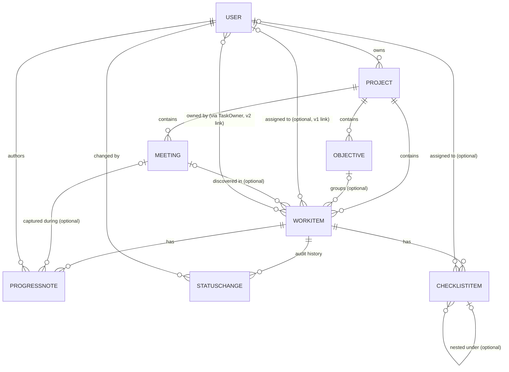

# Domain Model: Manager Planner / Executive Planning

**Path analyzed:** .
**Date analyzed:** 2026-07-27

> This repo ships two independent Avalonia desktop front ends (`src/ExecutivePlanning.Desktop`,
> `src/ManagerPlanner.Desktop`) over one shared domain/data library, `src/ExecutivePlanning.Core`.
> All entities, relationships and business rules below were read directly from
> `src/ExecutivePlanning.Core/Domain/*.cs`, `Data/PlanningDbContext.cs`, `Data/DbSeeder.cs`,
> `Services/PlanningService.cs`, `Services/PlanningValidation.cs` and `Services/Reports.cs` during
> this session — the automated domain collector returned empty `type_declarations`/
> `validation_routine_candidates` for this codebase (it is tuned for a different UI-framework
> shape), so every finding here is anchored to a file opened directly rather than to a
> pre-parsed fact.

## Entities

### User — `src/ExecutivePlanning.Core/Domain/User.cs`
"A person in the system — either the Manager who plans, or a Team Member work is assigned to."
Fields: `Id`, `FullName`, `Email`, `Role` (`UserRole`), `IsActive`; navigation `OwnedProjects`,
`AssignedTasks` (v1 single-assignee link), `OwnedTasks` (v2 many-to-many via `TaskOwner`).

Inference: the schema supports many `User` rows, but only one is ever "the Manager acting in the
app" at a time — both `MainWindowViewModel.InitializeAsync` and `MainViewModel.InitializeAsync`
pick `users.FirstOrDefault(u => u.Role == UserRole.Manager)?.Id` as `_currentUserId` and never let
the operator switch identity — so despite the data model allowing multiple Manager rows, the
running app behaves as single-manager software.

### Project — `Domain/Project.cs`
"A body of work the Manager plans and tracks. Owns many tasks and meetings."
Fields: `Id`, `Name`, `Description?`, `Status` (`ProjectStatus`), `CreatedUtc`, `OwnerId`/`Owner`
(FK to `User`); navigation `Objectives`, `Tasks`, `Meetings`.

Inference: "Project" is used loosely for any manager-led initiative, not only software delivery —
`DbSeeder.cs`'s third seeded project, `"Key Account — Tracsis"` ("Grow Tracsis into a key channel:
build relationships beyond a single contact"), models client-relationship management with the
identical `Project → Objective → WorkItem` shape used for the engineering-style
`"Q3 Platform Migration"` project.

### Objective — `Domain/Objective.cs`
"A goal within a project (e.g. 'Ship migration to the new cloud'). Sits between Project and
WorkItem so work is grouped the way a manager plans it: Project → Objective → Task."
Fields: `Id`, `Title`, `KeyResult?` ("optional key-result / definition of done for the
objective"), `SortOrder`, `ProjectId`/`Project`; navigation `Tasks`.

Inference: this is a lightweight OKR-style grouping — `KeyResult` is a free-text field, not a
measurable target/value pair, so the "OKR" resemblance is structural (Objective groups Tasks) more
than a fully-modeled OKR system.

### WorkItem (the "task") — `Domain/WorkItem.cs`
"A unit of work under a project, assigned to a team member with a deadline. Called WorkItem (not
Task) to avoid colliding with System.Threading.Tasks.Task. A task can be 'discovered' during a
meeting — in which case DiscoveredInMeetingId is set."
Fields: `Id`, `Title`, `Description?`, `Status` (`WorkItemStatus`), `Deadline?`, `CreatedUtc`,
`CompletedUtc?`, `IsDiscovered`; FKs `ProjectId`/`Project`, `ObjectiveId?`/`Objective` (optional),
`AssigneeId?`/`Assignee` (optional, v1 single-assignee link), `DiscoveredInMeetingId?`/
`DiscoveredInMeeting` (optional); navigation `Notes`, `StatusHistory`, `Checklist`, `Owners`.

Inference: `WorkItem` is the hub of the whole accountability feature — every other tracking
entity (`ProgressNote`, `StatusChange`, `ChecklistItem`, `TaskOwner`) hangs directly off it.

### ChecklistItem — `Domain/ChecklistItem.cs`
"A nested progress item under a task — the 'checklist' column in the planner grid. Items form a
tree via ParentId ..., each individually tickable and optionally owned by a person."
Fields: `Id`, `Label`, `IsDone`, `SortOrder`, `CompletedUtc?`; FKs `WorkItemId`/`WorkItem`,
`ParentId?`/`Parent`/`Children` (self-referencing tree), `AssigneeId?`/`Assignee` (optional).

Inference: the tree is generic enough to model more than literal sub-tasks — `DbSeeder.cs`'s
Tracsis project nests it as a stakeholder map (`"Chris — current contact"` → `"Peter — Portfolio
Director"`; `"Jenny — Head of QA"` → `"Jenesh — QA Lead"`, `"Richard — QA Lead"`), i.e. the same
structure doubles as an org-chart/relationship map for account-management use.

### TaskOwner — `Domain/TaskOwner.cs`
"Join entity for the many-to-many between tasks and their owners, so a task can be owned by
several people ('Nimal & Sara'). Kept explicit ... so ownership can carry data later (e.g. lead vs.
support) and to keep the relational model obvious." Composite-key fields: `WorkItemId`/`WorkItem`,
`UserId`/`User`. No extra data beyond the two FKs today.

Inference: this coexists with (and duplicates) `WorkItem.AssigneeId` — the doc comment on
`WorkItem.AssigneeId` calls it "single-assignee link, from v1", implying `TaskOwner` is the
intended v2 replacement, but neither `PlanningService` nor either desktop app retires the older
field; both are populated independently in `DbSeeder.cs`.

### Meeting — `Domain/Meeting.cs`
"A recorded conversation (video/physical/phone) between the Manager and a team member. Notes
captured during the meeting hang off this record, giving the Manager a per-meeting history to
cross-check what was promised versus what was delivered." Fields: `Id`, `Title`, `Type`
(`MeetingType`), `MeetingDate`; FKs `ProjectId`/`Project`, `ParticipantId?`/`Participant`
(optional); navigation `Notes`, `DiscoveredTasks`.

### ProgressNote — `Domain/ProgressNote.cs`
"A note the Manager records against a task — typically during a meeting — capturing what the team
member said. This is the heart of the accountability feature: the Manager can flag that the member
*promised* something by a certain date, then later cross-check promise vs delivery." Fields: `Id`,
`Text`, `CreatedUtc`, `NoteDate` ("the date the note is *about* ..., distinct from when it was
typed"), `IsPromise`, `PromisedDate?`; FKs `WorkItemId`/`WorkItem`, `MeetingId?`/`Meeting`
(optional), `AuthorId`/`Author`.

### StatusChange — `Domain/StatusChange.cs`
"Immutable audit record of a task status transition. Gives the Manager a defensible history of
when work actually moved forward (or stalled)." Fields: `Id`, `FromStatus`, `ToStatus`,
`ChangedUtc`, `Reason?`; FKs `WorkItemId`/`WorkItem`, `ChangedById`/`ChangedBy`.

Inference: "immutable" is a design intent stated only in the doc comment — `PlanningService`
exposes no update/delete method for `StatusChange` rows; the only way one is created is via
`ChangeStatusAsync`, and the only way one is removed is transitively, by deleting its parent
`WorkItem`/`Project` (cascade).

### Derived / non-persisted read models — `Services/Reports.cs`
`AccountabilityRow` and `ProjectSummary` are **not** EF-mapped entities — neither appears as a
`DbSet` in `PlanningDbContext.cs` nor is configured in `OnModelCreating`. They are computed
on-the-fly by `PlanningService.GetAccountabilityReportAsync`/`GetProjectSummaryAsync` from live
`WorkItem`/`ProgressNote` rows, on every call, and thrown away after rendering. `AccountabilityRow`
carries the `Verdict` business logic described under Business Rules below; `ProjectSummary` carries
per-project task counts (`TotalTasks`, `Done`, `InProgress`, `Blocked`, `NotStarted`, `Overdue`,
`Discovered`, and a computed `PercentComplete`).

## Relationships



Every edge and cardinality above is read directly from `PlanningDbContext.OnModelCreating`
(`src/ExecutivePlanning.Core/Data/PlanningDbContext.cs`, lines 24–195), where the FK's C# nullability
(`int` vs `int?`) sets the "one" vs "zero-or-one" end and the configured `DeleteBehavior` sets the
delete rule:

- **`User` → `Project` (owns), `Restrict`.** `Project.OwnerId` is non-nullable — a Manager cannot
  be deleted while still owning projects (no `DeleteUserAsync` exists in `PlanningService` at all,
  so this restriction is currently untestable through either UI).
- **`Project` → `Objective`/`WorkItem`/`Meeting`, `Cascade`.** Deleting a project removes every
  objective, task and meeting under it in one operation — confirmed by
  `PlanningService.DeleteProjectAsync` (a single `_db.Projects.Remove(p)` call, no manual cleanup)
  and by tests `Deleting_project_cascades_to_tasks_and_notes` / `DeleteProject_removes_everything_under_it`.
- **`Objective` → `WorkItem` (optional), `SetNull`.** A task's objective grouping is optional; a
  task survives its objective being removed (though no UI path currently removes a single
  objective — see Named Gaps).
- **`User` (assignee) → `WorkItem`, `SetNull`.** Removing a user un-assigns their tasks rather than
  deleting them — the v1 single-assignee link.
- **`Meeting` → `WorkItem` (discovered-in), `SetNull`.** A discovered task keeps existing if its
  originating meeting is deleted.
- **`WorkItem` → `ProgressNote`/`StatusChange`/`ChecklistItem`, `Cascade`.** Deleting a task removes
  its full note history, status audit trail, and checklist tree in one operation — confirmed by
  `PlanningService.DeleteTaskAsync` and tests `Deleting_task_cascades_to_checklist_and_owners` /
  `DeleteTask_removes_nested_checklist`.
- **`Meeting` → `ProgressNote` (optional), `SetNull`.** A note survives its meeting being deleted.
- **`User` (author/changed-by) → `ProgressNote`/`StatusChange`, `Restrict`.** The Manager who wrote
  a note or changed a status cannot be deleted while that record exists — consistent with these
  rows being an audit trail.
- **`ChecklistItem.Parent` self-reference, `Restrict`** — explicitly *not* `Cascade`, per the code
  comment: "Restrict (children removed in app code) to avoid multiple cascade paths on SQLite."
  In practice this path is never exercised directly: no `PlanningService` method deletes a single
  `ChecklistItem`; the only removal path is the whole-`WorkItem` cascade, which deletes every
  checklist row (parents and children alike) together, sidestepping the self-referencing `Restrict`
  rule entirely (see Named Gaps in the functional spec).
- **`WorkItem` ↔ `User` via `TaskOwner`, `Cascade` on both FKs.** A true many-to-many — a task can
  have several owners and a person can own several tasks — confirmed by
  `PlanningService.SetOwnersAsync` (replaces the full owner set) and test `Task_can_have_multiple_owners`.

## Business Rules

All rules below are read directly from `src/ExecutivePlanning.Core/Services/PlanningValidation.cs`
(the `PlanningRules` static class) and `Services/PlanningService.cs`, cross-checked against
`tests/ExecutivePlanning.Tests/PlanningServiceTests.cs` where a matching test exists.

1. **Project name required, ≤120 chars** — `PlanningRules.ValidateProjectName`
   (`PlanningValidation.cs:21-27`). Rejects an empty/whitespace-only name and any name over
   `MaxProjectName` (120) characters. Mechanical: the 120-character ceiling has no stated
   rationale in the code.
2. **Task title required, ≤120 chars** — `ValidateTaskTitle` (`:29-35`), same shape as above;
   test `AddTask_rejects_empty_and_overlong_titles` exercises both branches.
3. **Objective title required, ≤150 chars** — `ValidateObjectiveTitle` (`:37-43`). Mechanical:
   no stated reason for 150 vs. the task/project limit of 120.
4. **Checklist label required, ≤300 chars** — `ValidateChecklistLabel` (`:45-51`).
5. **Note text required, ≤2000 chars** — `ValidateNoteText` (`:53-59`). The empty-text message
   ("The note is empty — type what was said before saving.") states the *intent* (a note must
   capture actual spoken content) but the 2000-character ceiling itself is mechanical/unexplained.
6. **A note can only be dated within a fixed backward/forward window** —
   `ValidateNoteDate` (`:61-75`, `NoteBackdateMonths = 1`). Rejects a note dated more than one
   month before today (mechanical — the choice of exactly one month is not explained anywhere in
   the code) and rejects any note dated after today. Inference: forbidding future dates is
   consistent with a `ProgressNote` representing something a team member has *already* said (per
   `ProgressNote.cs`'s doc comment), but the validator itself states only the mechanism, not this
   reasoning — test `AddNote_rejects_dates_more_than_a_month_back_or_future` exercises both
   boundaries.
7. **Promised-vs-delivered verdict computation** —
   `PlanningService.GetAccountabilityReportAsync` (`PlanningService.cs:269-330`) +
   `AccountabilityRow.Verdict` (`Reports.cs:37-47`). For each task, only the **most recently
   created** promise note (`IsPromise && PromisedDate.HasValue`, ordered by `CreatedUtc` descending)
   is used — an earlier promise is entirely superseded, confirmed by test
   `Accountability_uses_latest_promise`. The verdict is evaluated in this exact precedence order:
   ```mermaid
   flowchart TD
     Q1{"PromiseKept?<br/>(Done AND CompletedUtc.Date &lt;= PromisedDate.Date)"}
     Q1 -->|Yes| V1["Verdict: Kept promise"]
     Q1 -->|No| Q2{"PromiseBroken?<br/>(Done-but-late, OR not-Done and PromisedDate.Date &lt; today)"}
     Q2 -->|Yes| V2["Verdict: BROKE promise"]
     Q2 -->|No| Q3{"IsOverdue?<br/>(Deadline passed AND Status != Done)"}
     Q3 -->|Yes| V3["Verdict: Overdue (no promise)"]
     Q3 -->|No| Q4{"Has any promise on record?"}
     Q4 -->|Yes| V4["Verdict: Promise pending"]
     Q4 -->|No| V5["Verdict: On track"]
   ```
   Rows are then sorted broken-first, then overdue-first, then soonest-deadline-first — the code
   comment states the rationale directly: "Most at-risk first: broken promises, then overdue, then
   the rest." One code-level nuance worth flagging: `IsOverdue` is computed independently of
   whether a promise exists, and is checked *before* `LatestPromisedDate.HasValue` in the `Verdict`
   getter — so a task whose own deadline has passed but which *does* carry a promise not yet due
   (not yet "broken") is labeled "Overdue (no promise)" even though a promise is in fact on record.
   This is a direct reading of the code's evaluation order, not a guess.
8. **Changing a task to its current status is a no-op** — `ChangeStatusAsync`
   (`PlanningService.cs:184-205`): `if (task.Status == newStatus) return;` before any
   `StatusChange` row is written. Confirmed by test `ChangeStatus_to_same_status_is_noop`.
9. **Completion timestamp tracks the Done transition, both ways** — `ChangeStatusAsync`:
   `task.CompletedUtc = newStatus == WorkItemStatus.Done ? DateTime.UtcNow : null;` — moving a task
   *out* of `Done` clears `CompletedUtc` back to `null`, not just setting it when entering `Done`.
   Mechanical: the code does this unconditionally; no comment discusses re-opening a completed task.
10. **Setting task owners replaces the full set, it does not append** — `SetOwnersAsync`
    (`PlanningService.cs:172-179`) removes every existing `TaskOwner` row for the task before
    adding the new set. Confirmed by the second assertion in test `Task_can_have_multiple_owners`.
11. **Toggling a checklist item stamps/clears its completion time** — `ToggleChecklistItemAsync`
    (`PlanningService.cs:162-169`): `item.CompletedUtc = isDone ? DateTime.UtcNow : null;`.

## Enumerations

- **`ProjectStatus`** (`Domain/Enums.cs:4-10`) — `Active = 0`, `OnHold = 1`, `Completed = 2`,
  `Cancelled = 3`. Doc comment: "Lifecycle of a project." Inference: a standard four-state project
  lifecycle — `Active` (currently being worked), `OnHold` (paused), `Completed` (finished),
  `Cancelled` (abandoned before completion). Note: no code path in `PlanningService` or either
  desktop app currently lets the user change a project's `Status` after creation (`AddProjectAsync`
  always creates it as the struct default, `Active`) — this enum's other three values are only ever
  set by hand in a debugger/DB tool, never through the running apps (see Named Gaps in the
  functional spec).
- **`WorkItemStatus`** (`:13-19`) — `NotStarted = 0`, `InProgress = 1`, `Blocked = 2`, `Done = 3`.
  Doc comment: "Lifecycle of a task. Named WorkItemStatus to avoid clashing with
  System.Threading.Tasks." Inference: the standard task-tracking lifecycle this whole app is built
  around; every status transition is audited via `StatusChange` (rule 8/9 above) and every
  "overdue"/"broken promise" computation keys off whether a task's status equals `Done`.
- **`MeetingType`** (`:22-27`) — `VideoCall = 0`, `PhysicalMeeting = 1`, `PhoneCall = 2`. Doc
  comment: "How the manager met the team member." Inference: models the channel through which a
  conversation happened, matching README.md's framing of "video/physical/phone meetings" — purely
  descriptive metadata on a `Meeting`, with no behavior in `PlanningService` keyed off the value.
- **`UserRole`** (`:30-34`) — `Manager = 0`, `TeamMember = 1`. Doc comment: "Role of a person in the
  system." Inference: distinguishes the app's one operator persona (`Manager`, whose account both
  `MainWindowViewModel`/`MainViewModel` pick as `_currentUserId` at startup) from the people being
  tracked (`TeamMember`) — there is no login/authentication anywhere in the codebase (confirmed
  during the companion architecture analysis), so this role is a data classification, not an
  access-control mechanism.
