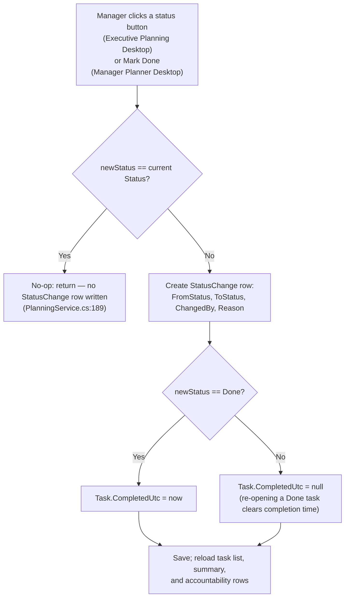
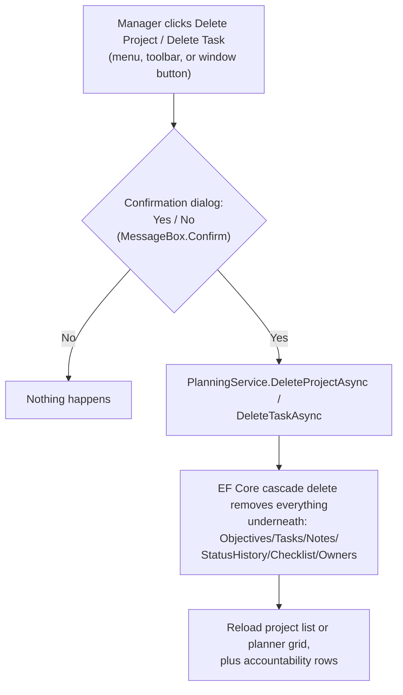
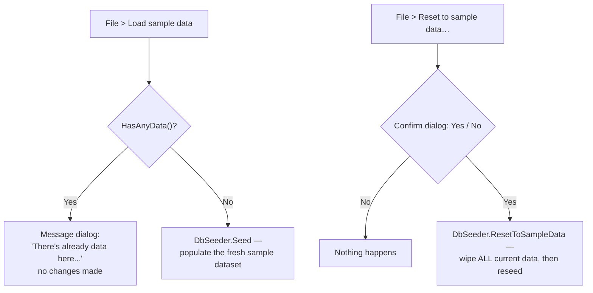

# Functional Spec: Manager Planner / Executive Planning

**Path analyzed:** .
**Date analyzed:** 2026-07-27

> Two independent Avalonia desktop front ends ship in this repo: `src/ExecutivePlanning.Desktop`
> (the original tabbed UI) and `src/ManagerPlanner.Desktop` (a newer Win95-style MDI shell — the
> one the five most recent commits and the `publish/` scripts target). Both call the same
> `ExecutivePlanning.Core`/`PlanningService`. The automated domain collector's `forms`/`xaml_forms`/
> `handler_implementations` fields came back empty for this repo (it does not recognize Avalonia
> `.axaml`), so every capability, workflow step and control below is anchored to a `.axaml`/
> `.axaml.cs`/ViewModel file opened directly in this session, not to a pre-parsed fact.

## Capabilities

### Executive Planning Desktop (`src/ExecutivePlanning.Desktop`, tabbed UI — `Views/MainWindow.axaml`)

- **Switch the active project** — header `ComboBox` bound to `Projects`/`SelectedProject`
  (`MainWindow.axaml:24-32`); driven by `MainWindowViewModel.OnSelectedProjectChanged` →
  `ReloadProjectDataAsync` (`MainWindowViewModel.cs:91,95-114`).
- **Refresh the selected project's data** — header "Refresh" `Button` → `RefreshCommand` →
  `RefreshAsync` (`:211-216`).
- **View project summary counts** (Total/Done/In progress/Blocked/Not started/Overdue/% complete)
  — left-rail read-only bindings to `Summary` (`MainWindow.axaml:56-74`), populated by
  `PlanningService.GetProjectSummaryAsync`.
- **Create a new project** — left-rail "New project" panel: `TextBox` (name) + `TextBox`
  (description) + "Add project" `Button` → `AddProjectCommand` → `AddProjectAsync`
  (`:126-135`), validated by `PlanningRules.ValidateProjectName`.
- **Tasks & Assignments tab:**
  - View all tasks for the project in a read-only `DataGrid` (Task/Assignee/Deadline/Status/
    Discovered columns) and select one (drives the Meetings & Notes tab's note list).
  - **Set a task's status** — four buttons ("Not started"/"In progress"/"Blocked"/"Mark done"),
    each `Command="{Binding SetStatusCommand}"` with a `WorkItemStatus` `CommandParameter`
    (`MainWindow.axaml:117-124`) → `SetStatusAsync` → `PlanningService.ChangeStatusAsync`
    (`:200-209`), which records a `StatusChange` audit row.
  - **Add a task** — title, assignee dropdown (team members), deadline `DatePicker`, optional
    description, "Discovered in a meeting" `CheckBox` → `AddTaskCommand` → `AddTaskAsync`
    (`:138-156`), validated by `PlanningRules.ValidateTaskTitle`.
- **Meetings & Notes tab:**
  - **Record a meeting** — title, type dropdown (`VideoCall`/`PhysicalMeeting`/`PhoneCall`),
    participant dropdown, date picker → `AddMeetingCommand` → `AddMeetingAsync` (`:158-174`).
  - Browse the project's meeting history (read-only `ListBox`).
  - Select a task (dropdown) to view/add progress notes against it.
  - **Add a progress note** — "What did they say?" text box, "This is a promise" `CheckBox`,
    a promised-date `DatePicker` enabled only when checked, and an optional "link to meeting"
    dropdown → `AddNoteCommand` → `AddNoteAsync` (`:176-198`), validated by
    `ValidateNoteText`/`ValidateNoteDate`; the command also immediately recomputes the
    Accountability tab's rows (`:193-197`).
  - View a task's note history in a read-only `DataGrid` (When/Note/Promise/Promised/By).
- **Accountability tab:** view the promised-vs-delivered report for the selected project,
  read-only `DataGrid` (Task/Assignee/Status/Deadline/Promised/Verdict), computed by
  `PlanningService.GetAccountabilityReportAsync`, most-at-risk sorted first
  (`MainWindow.axaml:259-275`).

### Manager Planner Desktop (`src/ManagerPlanner.Desktop`, Win95-style MDI shell)

**Menu bar** (`Views/MainWindow.axaml:14-39`):

- File ▸ *Load sample data* — `LoadSampleDataCommand` → `MainViewModel.LoadSampleData`
  (`MainViewModel.cs:258-269`): seeds only if the database is currently empty, otherwise shows a
  message dialog.
- File ▸ *Reset to sample data…* — `ResetSampleDataCommand` → `ResetSampleData`
  (`:271-281`): confirmation dialog, then wipes and reseeds via `DbSeeder.ResetToSampleData`.
- File ▸ *Exit* — `Click="OnExit"` → `MainWindow.axaml.cs:46` → `Close()`.
- View ▸ *Refresh* — `RefreshCommand` → `Refresh` (`:251-256`).
- Task ▸ *Mark selected Done* — `MarkDoneCommand` → `MarkDone` (`:176-186`) →
  `ChangeStatusAsync(..., Done)`.
- Task ▸ *Delete selected task* — `DeleteTaskCommand` → `DeleteTask` (`:233-249`): confirmation
  dialog, then `PlanningService.DeleteTaskAsync` (cascades to checklist/notes/owners).
- Window ▸ *Cascade* / *Tile* — `Click="OnCascade"`/`"OnTile"` (`MainWindow.axaml.cs:47-48`) →
  `MdiHost.Cascade()`/`Tile()`.
- Window ▸ *Show Projects* / *Show Planner Grid* / *Show Notes* / *Show Accountability Report* —
  `Click` handlers (`:49-52`) → `MdiHost.Restore(...)`, un-hiding/refocusing a child MDI window.
- Help ▸ *About* — `Click="OnAbout"` (`:54-70`) → a static About dialog (name/version blurb, no
  dynamic data).

**Toolbar** and **Window bar** (`MainWindow.axaml:42-63`) duplicate the same commands/handlers as
clickable buttons: Mark Done, Delete Task, Refresh, Cascade, Tile, Projects, Planner Grid,
Task+Notes, Accountability.

**Projects window** (`Views/ProjectsView.axaml`):

- Browse all projects (`ListBox`, Name + Description), select one — drives the Planner Grid,
  Task+Notes and Accountability windows.
- **Create a project** — Name/Description `TextBox`es + "➕ Add project" `Button` →
  `AddProjectCommand`.
- **Delete the selected project** — "🗑 Delete selected" `Button` → `DeleteProjectCommand`
  (confirmation dialog first; cascades to everything under the project).

**Planner Grid window** (`Views/PlannerGridView.axaml`):

- **Add an objective** to the selected project — `TextBox` + "Add" `Button` →
  `AddObjectiveCommand` → `PlanningService.AddObjectiveAsync`.
- View tasks grouped by objective; each row shows owners/status and a nested, expandable
  checklist (`TreeView`, auto-expanded via the `TreeViewItem.IsExpanded=True` style,
  `PlannerGridView.axaml:9-11`).
- **Add a task inline** under a specific objective — per-group "+ add task to this objective"
  `TextBox` + "Add task" `Button` → `ObjectiveGroupVm.AddTaskCommand` → `MainViewModel.OnAddTask`
  (`:120-131`) → `PlanningService.AddTaskAsync` (title only — see Named Gaps for what is not
  wired here).
- **Select a task** — clicking the task cell (`Button Classes="row"` → `TaskRowVm.SelectCommand`,
  `RowViewModels.cs:53-54`) → `MainViewModel.OnSelectTask` → surfaces/focuses the Task+Notes
  window via the `NotesRequested` event.
- **Tick/untick a nested checklist item** — `CheckBox` in the `TreeView` bound to
  `ChecklistItemVm.IsDone` → `PlanningService.ToggleChecklistItemAsync`
  (`RowViewModels.cs:19-24`).
- Visual-only flags computed client-side: "OVERDUE" badge (deadline passed, not Done) and
  "⚑ discovered" badge (`IsDiscovered`).

**Task + Notes window** (`Views/TaskNotesView.axaml`):

- View the selected task's title and its full, date-ordered note timeline.
- **Mark the selected task Done** — "✔ Mark Done" `Button` → `MarkDoneCommand`.
- **Add a dated progress note** — date `DatePicker`, "is a promise" `CheckBox`, promised-date
  `DatePicker`, free-text box → `AddNoteCommand` → `MainViewModel.AddNote` (`:154-174`).

**Accountability Report window** (`Views/AccountabilityView.axaml`):

- View the promised-vs-delivered report across **all** projects (not just the selected one) —
  Project/Task/Owner/Deadline/Status/Promised/Verdict columns, verdict text color-coded (green =
  kept, red = broken, amber = overdue, blue = pending, grey = on track,
  `AccountabilityRowVm.VerdictBrush`, `RowViewModels.cs:157-162`) — computed by
  `PlanningService.GetAccountabilityForAllProjectsAsync`. This window is read-only; no commands.

**MDI window chrome** (applies to all four child windows — `Controls/MdiWindow.cs` +
`Controls/MdiWindow.axaml`):

- Drag the title bar (`PART_TitleBar`) to reposition a window.
- Double-click the title bar, or the `PART_Max` button, to maximize/restore
  (`MdiWindow.cs:104-126`).
- Drag the bottom-right resize grip (`PART_Resize`, a `Thumb`) to resize.
- Minimize (`PART_Min`) and close (`PART_Close`) both simply hide the window
  (`IsVisible = false`) — recoverable only via the Window menu / window bar's "Show ..." buttons,
  not a taskbar (see Named Gaps).

## Workflows

### Recording what was said and tracking a promise (Executive Planning Desktop)

A linear sequence with one built-in decision cascade at the end. Steps, each grounded in a file
opened this session:

1. Manager has a project selected; opens the **Meetings & Notes** tab.
2. Records a meeting (title, type, participant, date) — `AddMeetingCommand` →
   `PlanningService.AddMeetingAsync`.
3. Selects a task from the task dropdown (`MainWindow.axaml:207-215`).
4. Types what the member said, checks "This is a promise", picks a promised date, optionally
   links the meeting — `AddNoteCommand` → `MainWindowViewModel.AddNoteAsync`
   (`:176-198`), which calls `PlanningRules.ValidateNoteText`/`ValidateNoteDate` before persisting.
5. The same command handler immediately reloads both the task's note list **and** the
   Accountability tab's rows (`MainWindowViewModel.cs:193-197` explicitly re-queries
   `GetAccountabilityReportAsync` right after saving the note) — so the manager does not need to
   manually refresh to see the effect of a new promise.
6. Switching to the **Accountability** tab shows the updated verdict for that task, per the
   verdict-precedence decision cascade documented in `domain-model.md`'s Business Rules section
   (rule 7) — `Kept promise` → `BROKE promise` → `Overdue (no promise)` → `Promise pending` →
   `On track`, in that evaluation order.

### Changing a task's status and building the audit trail (both apps)

Grounded in `PlanningService.ChangeStatusAsync` (`PlanningService.cs:184-205`) and tests
`ChangeStatus_records_history_and_completion` / `ChangeStatus_to_same_status_is_noop`. Both apps'
"Mark done"/status-button commands funnel through this single service method.

### Deleting a project or a task (both apps)

Grounded in `ManagerPlanner.Desktop/ViewModels/MainViewModel.cs` (`DeleteProject`: lines 218-231,
`DeleteTask`: lines 233-249), `Controls/MessageBox.Confirm`, and the cascade rules in
`PlanningDbContext.OnModelCreating` (see `domain-model.md`, Relationships). Note: Executive
Planning Desktop has no delete UI at all for either projects or tasks — this workflow is
Manager-Planner-Desktop-only (see Named Gaps).

### Loading vs. resetting sample data (Manager Planner Desktop only)

Grounded in `MainViewModel.LoadSampleData`/`ResetSampleData` (`MainViewModel.cs:258-281`) and
`Data/DbSeeder.cs` (`SeedIfEmpty`/`ResetToSampleData`, lines 14-38). Executive Planning Desktop has
no equivalent UI command — it only auto-seeds once, silently, if the database is empty at startup
(`App.axaml.cs:22`, `DbSeeder.SeedIfEmpty(db)`), with no manual "load"/"reset" trigger exposed.

### Task selection → Notes drill-down (Manager Planner Desktop MDI shell)

Linear, no branching — described in prose per the rubric. In the Projects window the manager
selects a project, which populates the Planner Grid window (`MainViewModel.ReloadGridAsync`,
`:88-111`, loading objectives → tasks → checklist via `GetPlannerForProjectAsync`). Clicking a
task row in the grid (`TaskRowVm.SelectCommand`) calls `MainViewModel.OnSelectTask`
(`:134-143`), which marks that row selected, loads its notes (`LoadNotesAsync`), and raises the
`NotesRequested` event. `MainWindow.axaml.cs`'s `OnOpened` handler wired that event at startup
(`:40`) to call `Host.Restore(_notesWin)` — so the Task+Notes window automatically pops to the
front the moment any task is selected, without the manager needing to find it via the Window menu.

## UI Inventory

### `src/ExecutivePlanning.Desktop`

| Surface | Type | Parsed? | Controls / commands |
|---|---|---|---|
| `Views/MainWindow.axaml` + `.axaml.cs` | `Window` (single, tabbed) | Fully read | Header (project `ComboBox`, Refresh button), left rail (summary panel, new-project form), 3-tab `TabControl` (Tasks & Assignments / Meetings & Notes / Accountability). 7 distinct commands (`RefreshCommand`, `AddProjectCommand`, `SetStatusCommand`, `AddTaskCommand`, `AddMeetingCommand`, `AddNoteCommand` — plus `SetStatusCommand` bound 4× with different `CommandParameter` values), all implemented in `ViewModels/MainWindowViewModel.cs`. Code-behind (`MainWindow.axaml.cs`) is an 11-line trivial partial class — `InitializeComponent()` only, no event handlers. |
| `App.axaml` / `App.axaml.cs` | Application resources + composition root | Fully read | Not a navigable UI surface — declares `Avalonia.Themes.Fluent` + `Avalonia.Fonts.Inter`; `App.axaml.cs.OnFrameworkInitializationCompleted` builds the DB, service, and `MainWindow`. |

### `src/ManagerPlanner.Desktop`

| Surface | Type | Parsed? | Controls / commands |
|---|---|---|---|
| `Views/MainWindow.axaml` + `.axaml.cs` | `Window` (MDI shell) | Fully read | Menu bar: 5 top-level menus, 13 `MenuItem`s total (File: 3, View: 1, Task: 2, Window: 6, Help: 1). Toolbar: 5 buttons. Window bar: 4 buttons. Status bar: 3 read-only fields. Hosts a `controls:MdiHost`. Code-behind implements all 9 `Click` handlers (`OnOpened`, `OnExit`, `OnCascade`, `OnTile`, `OnShowProjects`, `OnShowPlanner`, `OnShowNotes`, `OnShowReport`, `OnAbout`) and all 5 bound commands (`LoadSampleDataCommand`, `ResetSampleDataCommand`, `RefreshCommand`, `MarkDoneCommand`, `DeleteTaskCommand`) resolve to real methods in `ViewModels/MainViewModel.cs`. |
| `Views/ProjectsView.axaml` + `.axaml.cs` | `UserControl` (MDI child content) | Fully read | `ListBox` (projects), 2 `TextBox`, 2 `Button` (`AddProjectCommand`, `DeleteProjectCommand`) — both implemented in `MainViewModel.cs`. |
| `Views/PlannerGridView.axaml` + `.axaml.cs` | `UserControl` (MDI child content) | Fully read | Add-objective bar (`TextBox` + `Button` → `AddObjectiveCommand`), grouped `ItemsControl` (objectives → tasks → nested `TreeView` checklist), per-task `SelectCommand`, per-checklist-item `IsDone` toggle, per-objective inline `AddTaskCommand` — all implemented in `ViewModels/RowViewModels.cs` + `MainViewModel.cs`. |
| `Views/TaskNotesView.axaml` + `.axaml.cs` | `UserControl` (MDI child content) | Fully read | 2 `DatePicker`, 1 `CheckBox`, 1 `TextBox`, 2 `Button` (`MarkDoneCommand`, `AddNoteCommand`) + read-only notes `ItemsControl` timeline. |
| `Views/AccountabilityView.axaml` + `.axaml.cs` | `UserControl` (MDI child content) | Fully read | Read-only `ItemsControl` bound to `AccountabilityRows` (all-projects report); no commands. |
| `Controls/MdiHost.cs` | Custom `Canvas`-derived control (no `.axaml`) | Fully read | `AddWindow`/`Cascade`/`Tile`/`Restore` — the MDI workspace host; not itself a form. |
| `Controls/MdiWindow.cs` + `Controls/MdiWindow.axaml` | Custom `HeaderedContentControl` (child-window chrome) | Fully read | Title bar drag, `PART_Min`/`PART_Max`/`PART_Close` buttons, `PART_Resize` grip — all handlers implemented directly in `MdiWindow.cs`. |
| `Controls/MessageBox.cs` | Static helper building ad-hoc `Window` dialogs (no `.axaml`) | Fully read | `Show` (OK-only) and `Confirm` (Yes/No) modal dialogs, Win95-styled. |
| `Themes/Win95.axaml` | Style/resource dictionary | Read (partial — color/style resources only) | Not a window or control with its own controls/handlers; supplies colors (`Win95Face`, etc.), base `TextBlock` styling, and `raised`/`sunken`/`group` border-bevel style classes consumed by every other view above. |
| `App.axaml` / `App.axaml.cs` | Application resources + composition root | Fully read | Not a navigable UI surface — declares `Avalonia.Themes.Simple` + includes `Win95.axaml`; `App.axaml.cs.OnFrameworkInitializationCompleted` builds the (separate) `planner.db`, service, and `MainWindow`. |

No `other_ui_files`-shaped entries (e.g. `.cshtml`) exist in this repo — `loc_by_extension` shows
only `.axaml`/`.cs`/`.csproj`/`.md`, and no web-view or non-Avalonia UI technology was found in
either desktop project.

## Named Gaps

1. **`ManagerPlanner.Desktop` has no Meeting-recording capability at all.** A repo-wide search
   confirms zero references to `Meeting` anywhere under `src/ManagerPlanner.Desktop` (`.cs` or
   `.axaml`). `PlanningService.AddMeetingAsync`/`GetMeetingsForProjectAsync` exist and are used by
   `ExecutivePlanning.Desktop`'s Meetings & Notes tab, but the newer, actively-published app (the
   one the last five commits and `publish/` scripts target) offers no UI to record a meeting,
   browse meeting history, or link a note to one.
2. **`WorkItem.DiscoveredInMeetingId` is never set through either app's UI.** In
   `ExecutivePlanning.Desktop`, the "Discovered in a meeting" checkbox only sets `IsDiscovered =
   true` — `MainWindowViewModel.AddTaskAsync` never passes `discoveredInMeetingId` (a repo-wide
   search for `discoveredInMeetingId` under that project returns nothing). In
   `ManagerPlanner.Desktop`, the inline "add task" (`MainViewModel.OnAddTask`) never passes
   `isDiscovered` at all, so it can never create a discovered task in the first place — the
   "⚑ discovered" badge in `PlannerGridView.axaml` only ever renders seeded data.
3. **No UI adds a new team member.** `PlanningService.AddUserAsync` exists but a repo-wide search
   shows it is called only from `tests/ExecutivePlanning.Tests/PlanningServiceTests.cs` — neither
   desktop app calls it. The team roster is fixed to whatever `DbSeeder.Seed` created (or existed
   before); "grow the team" is not a reachable capability in either running app today.
4. **No UI sets/changes task owners.** `PlanningService.SetOwnersAsync` (the many-to-many
   `TaskOwner` join) is likewise called only from tests and implicitly from `DbSeeder`. The Planner
   Grid's "Owner" column (`TaskRowVm.OwnersText`) is read-only and reflects only seeded data —
   there is no control in either app to add, remove, or change a task's owners.
5. **No UI adds a new checklist item.** `PlanningService.AddChecklistItemAsync` is called only
   from tests and `DbSeeder`. A manager can tick/untick *existing* checklist items in the Planner
   Grid, but cannot add a new one from either app's UI.
6. **`ManagerPlanner.Desktop`'s inline "add task" never exposes an assignee or a custom
   deadline.** `MainViewModel.OnAddTask` (`MainViewModel.cs:120-131`) always calls `AddTaskAsync`
   with `assigneeId: null` and a hardcoded `DateTime.UtcNow.AddDays(7)` deadline — unlike
   `ExecutivePlanning.Desktop`'s task-add form, which exposes both fields explicitly. No control in
   `PlannerGridView.axaml` lets the manager override either value.
7. **Minimized/closed MDI child windows have no taskbar-equivalent.** `MdiWindow.cs`'s `PART_Min`
   and `PART_Close` handlers both just set `IsVisible = false` (lines 44-49) — the only recovery
   path is the Window menu or window bar's "Show ..." buttons (`MdiHost.Restore`). This works as
   designed, but a first-time user who closes or minimizes a window without noticing the Window
   menu has no other visible way to bring it back.
8. **None of gaps 1–6 are caught by any automated test.** `tests/ExecutivePlanning.Tests`'s only
   `ProjectReference` is to `ExecutivePlanning.Core` (confirmed via `dependency_graph` and by
   reading `PlanningServiceTests.cs`/`TestDb.cs` directly) — no ViewModel command body in either
   desktop project, and no MDI chrome behavior in `Controls/MdiWindow.cs`, has test coverage. Every
   gap above was found by direct source inspection in this session, not by a failing test.
9. **`ChecklistItem.Parent`'s `Restrict` delete rule is never actually exercised on its own.** The
   comment in `PlanningDbContext.cs` explains the self-reference is `Restrict` rather than
   `Cascade` "to avoid multiple cascade paths on SQLite," implying single-item deletion needs
   app-level cleanup — but no `PlanningService` method deletes an individual `ChecklistItem`; the
   only removal path is the whole-`WorkItem` cascade (which removes every checklist row together,
   parents and children alike, without touching the self-reference rule). Whether removing one
   nested sub-tree while preserving siblings would work is unconfirmed by any code path read this
   session.
10. **No UI changes a `Project`'s `Status`.** `AddProjectAsync` always creates a project as the
    struct default, `ProjectStatus.Active`; no command in either app's `ProjectsView`/new-project
    form sets `OnHold`/`Completed`/`Cancelled`. Those three enum values exist in the schema and are
    read by nothing in the running apps beyond their default value.
11. **This document's UI-layer findings rest on manual file reads, not collector facts.** The
    domain collector's `forms`/`xaml_forms`/`other_ui_files`/`handler_implementations` fields
    returned empty for every file in this repo (it targets a different UI-framework shape than
    Avalonia `.axaml`); every capability, workflow, and inventory row above was produced by
    directly opening each `.axaml`/`.axaml.cs`/ViewModel file in both desktop projects during this
    session rather than from pre-parsed collector output — noting this as a tooling-coverage gap,
    not a gap in the underlying domain.
